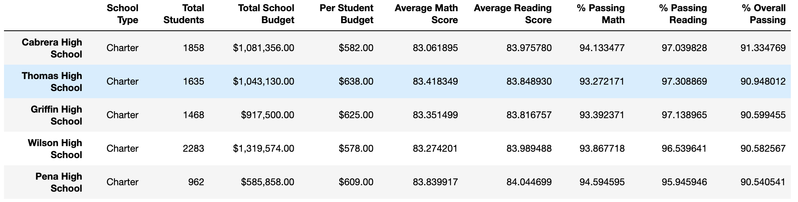
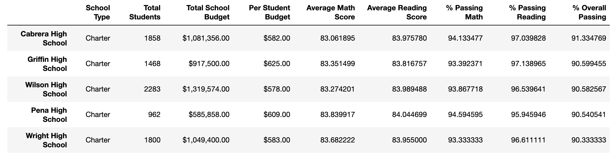
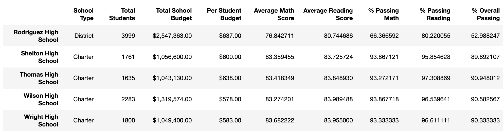
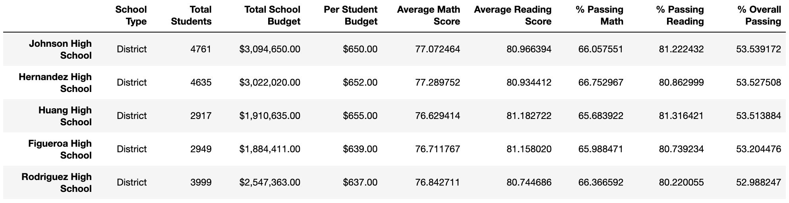
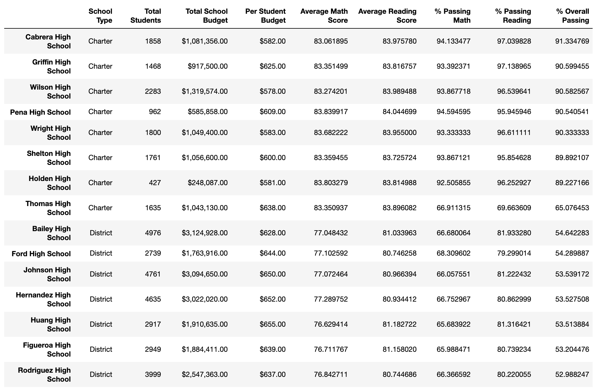
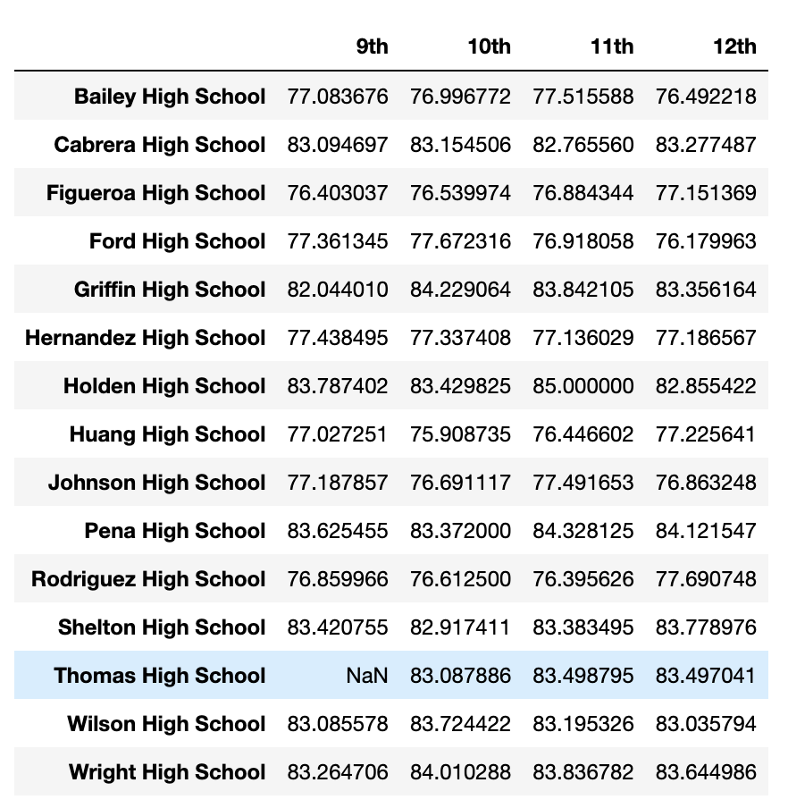
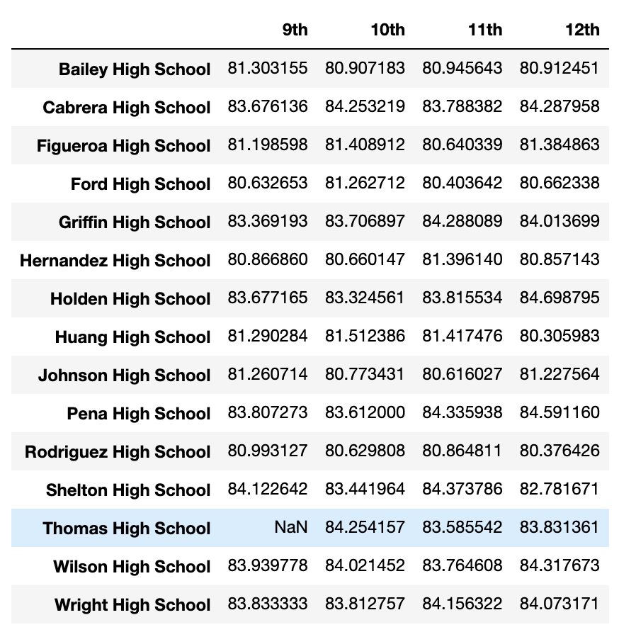

# School_District_Analysis

The district summary DataFrame (3 pt)
The school summary DataFrame (3 pt)
The top 5 performing schools, based on the overall passing rate (2 pt)
The bottom 5 performing schools, based on the overall passing rate (2 pt)
The average math score for each grade level from each school (3 pt)
The average reading score for each grade level from each school (3 pt)
7 The scores by school spending per student (3 pt)

8 The scores by school size (3 pt)

9 The scores by school type (3 pt)

#Overview of the school district analysis: Explain the purpose of this analysis.

##The Analysis and the change
The initial analysis coveered the performance of the students in various dimensions. After it was discovered that the Thomas School students had their scores altered, the analysis was redone by resetting scores for the 9th grade students to null.

After that the tables was regenerated, and the comparison of the data before and after this adjustment will be shown below.

#Conclusions

How is the district summary affected?

How is the school summary affected?

How does replacing the ninth graders’ math and reading scores affect Thomas High School’s performance relative to the other schools?

How does replacing the ninth-grade scores affect the following:

Math and reading scores by grade

Scores by school spending

Scores by school size

Scores by school type

Summary: Summarize four changes in the updated school district analysis after reading and math scores for the ninth grade at Thomas High School have been replaced with NaNs.
