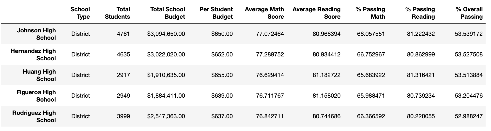

# School District Analysis

## The Analysis and the change
The initial analysis covered the performance of the students and their respective in various dimensions. After it was discovered that the Thomas School students of the 9th grades had their scores altered, the analysis was redone by resetting scores for the 9th grade students to null.

New tables were generated and the comparison between previous analysis and the current one is found below.

# Conclusions

## How is the district summary affected?

In the District summary, we see a small drop on the Average Math Score (79 to 78.9) while the Average Reading Score is the same (81.9).

We can also note a slight drop on the other indicators, % Passing Math came from 75 to 74.8, while the % Passinh Reading went from 86 to 85.7.
The % Overall Passing went from 65 to 64.9.

Here are the tables comparing the data:

#### Fig 01. Original District Summary.

#### Fig 02. District Summary after removing Thomas School 9th grade students.

## How is the school summary affected?

When analyzing the overall Metrics for Thomas High School, we have a small change in the Average Math Score (83.418349 to 83.350937) and in the Average Reading Score (83.848930 to 83.896082). Other Metrics were significantly impacted though. The % Passing Math drops from 93.272171 to 66.911315 and the % Passing Reading from 97.308869 to 69.663609. The % Overall Passing went from 90948012 to 65.076453.

#### Fig 03. Original Thomas High School Summary data.

#### Fig 04. Thomas High School Summary after removing 9th grade students.

## How does replacing the ninth graders’ math and reading scores affect Thomas High School’s performance relative to the other schools?

Originally, Thomas High School was places in the secodn place in the top 5 schools sorted by % Overall Score. As seem on the Fig. 06, removing the grades form the 9th students also impacts Thomas High School Ranking, as it's no longer listed on the Top 5 schools list.

### Fig 05. Original Top 5 Schools

### Fig 06. Top 5 Schools without Thomas students

Thomas High School wasn't originally on the Bottom 5 schools, and as seem on the Fig.08, it keeps not being on the bottom 5, even after the removal of the 9th grades students scores.

### Fig 07. Original Bottom 5 Schools

### Fig 08. Bottom 5 Schools without Thomas students

We can see in the Fig 09. that Thomas High School is now places in 8th position instead of 3rd, as shown in Fig 05.

### Fig 09. General ranking without Thomas students from 9th grade.

#############################################################################################################################
## How does replacing the ninth-grade scores affect the following:

Comparing Math and reading scores by grade

                            

Original Math Scores by Grade     |  All Stocks Analysis - 2018
:-------------------------:|:-------------------------:
  |  

Scores by school spending

Scores by school size

Scores by school type

Summary: Summarize four changes in the updated school district analysis after reading and math scores for the ninth grade at Thomas High School have been replaced with NaNs.
